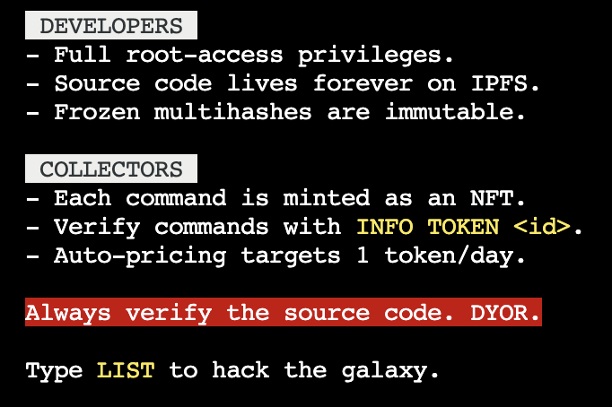

开发人员对星际 web3 终端拥有完全的 root 访问权限，其中源代码永远存在于 IPFS 上。 收集器控制包，这些包被铸造为 NFT。 冻结的多重哈希是不可变的。 自动定价会根据每天不断生成的代币进行调整。T3RM.DEV 是一个具有不可变冻结多重哈希的 NFT 集合。 每日生成的代币数量由自动定价决定。 它由行星际 web3 终端中的命令支持。 用户可以通过铸造命令获得 NFT 集合的碎片。 他们还可以控制包裹。

