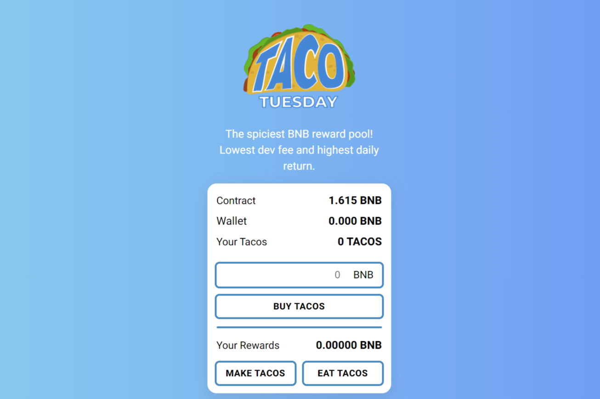

Taco Tuesdays 是 Token Miner 元数据的一个新变化。通过使用智能合约，它变得简单，3 个按钮，它们可以让您每天赚取高达 8% 的收益！你可以随时吃炸玉米饼！ （吃 Tacos 就是领取 BNB 奖励。只要 TVL 中还有 BNB）但我们建议只吃 Tacos（周二）。
为什么？因为如果您吃得太频繁，它会自动将您的每日百分比降低 2%，直到您制作玉米卷（将您的奖励与您的总余额相结合）。这将使其每天增加 0.5%，直到达到 8%！
我们建议您查看我们网站上的白皮书，以便了解其中的机制。它有一个推荐系统，一个严厉的反倾销系统和它的所有公众！
我们的智能合约是完全可见的，任何人都可以查看！
有了这个 BNB 矿工，它是一个去中心化的工具，可以让用户完全免费获得一种投资方法。
BNB Miner 适用于希望获得长期利润和可持续性的用户。不适合那些想要立即获利的人将他们放入反倾销系统。
不要将 Taco Tuesdays Miner 与农场混淆。炸玉米饼厨师不是买来的，而是被雇用的，因此不能出售。一旦 Taco Chef 被雇用，他们就会无限期地为您工作，以每天 8% 的起始费率为您提供无限量的 BNB。

