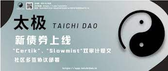

$TAC 是一种去中心化的储备货币，不受挂钩约束。​

这是一个非常成熟的项目，拥有超高的稳定收益，你值得拥有！
欢迎来到 defi2.0 世界。比 SquidGodFinance 更强大。

Discord 上的大奖励活动！！
加入：https://discord.gg/JbQB4vBxKv
1.保持活跃成为OG，随机赢取50美元。
2.制作模因和标签
@Bsc33DAO
  随机获得美元。$TAC 是一种去中心化的储备货币，不受挂钩的约束。

3. 将#BSC33分享给其他人，在Discord中发布你的截图，将获得0-1000美元的奖励。

   