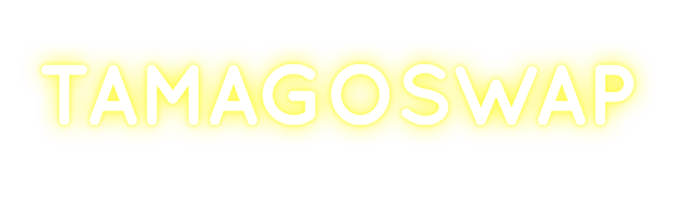

TamagoSwap 是 Polygon 网络上的新一代收益农场，它将包含 Equity Vault、自动可变排放率和 NFT，我们相信这将有助于提供一个具有可持续和弹性排放的农场，这将极大地造福我们的社区。
通过自动可变排放率，我们希望在不影响资金池的吸引力或阻止新投资者的情况下平衡价格波动。 通过 Equity Vaults，原生代币持有者将能够质押他们的 $TMGO，以在 USDC、WMATIC 等各种池中获得股权分配奖励。 这些奖励将根据各自的池（非本地人）而不是本地人支付。 NFT 也将被纳入以进一步促进 TamagoSwap 生态系统的发展。 已经设计和开发了一系列特别策划的 NFT，将在包括 NFT 价值和实用性在内的关键重点领域推出。
在 t.me/tamagoswap 加入社区。

