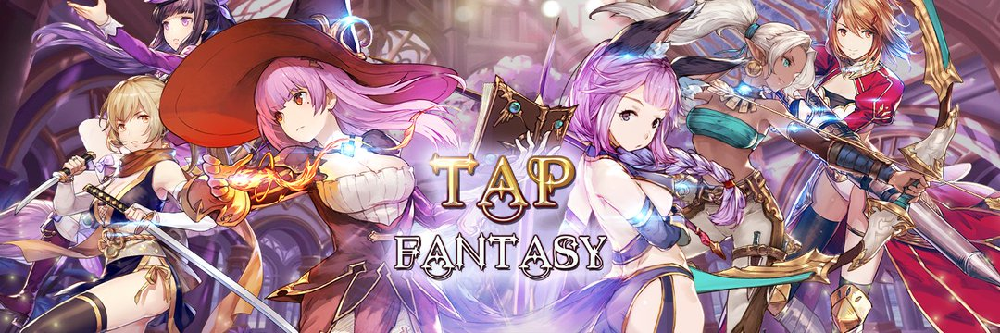

---
title: "Tap Fantasy"
description: "Tap Fantasy是一款HTML 5开发的MMORPG区块链游戏，玩家可以直接在网页或者钱包上进行交互，可以立即开始玩。"
date: 2022-08-20T00:00:00+08:00
lastmod: 2022-08-20T00:00:00+08:00
draft: false
authors: ["boogArno"]
featuredImage: "tap-fantasy.png"
tags: ["NFT Games","Tap Fantasy"]
categories: ["nfts"]
nfts: ["NFT Games"]
blockchain: ""
website: "https://dappradar.com/"
twitter: "https://twitter.com/tapfantasy2021"
discord: "http://discord.gg/tapfantasy"
telegram: ""
github: "https://github.com/tapfantasy/"
youtube: ""
twitch: ""
facebook: ""
instagram: ""
reddit: ""
medium: ""
steam: ""
gitbook: ""
googleplay: ""
appstore: ""
status: "Live"
weight: 
lightgallery: true
toc: true
pinned: false
recommend: false
recommend1: false
---
Tap Fantasy是一款HTML 5开发的MMORPG区块链游戏，玩家可以直接在网页或钱包上与Tap Fantasy互动，即刻开始游戏。 它既有 AXIE 的 PLAY TO EARN 模块，也有 Roblox 的 DESIGN TO EARN 开发者模块。
第三方游戏开发者可以使用 TP 的无代码地图编辑器设计和创建游戏模块。 游戏设计师从玩家在第三方游戏模块中消费的金币中获得 50% 的佣金。
设计师还可以 MINT 自己设计的 NFT 头像、壁纸、建筑、角色皮肤外观，并出售给市场上的玩家。
经过几年的积累，我们现在拥有200多个ACG角色，加上我们在日本的合作伙伴也有大量的动画资源加入元界世界。

