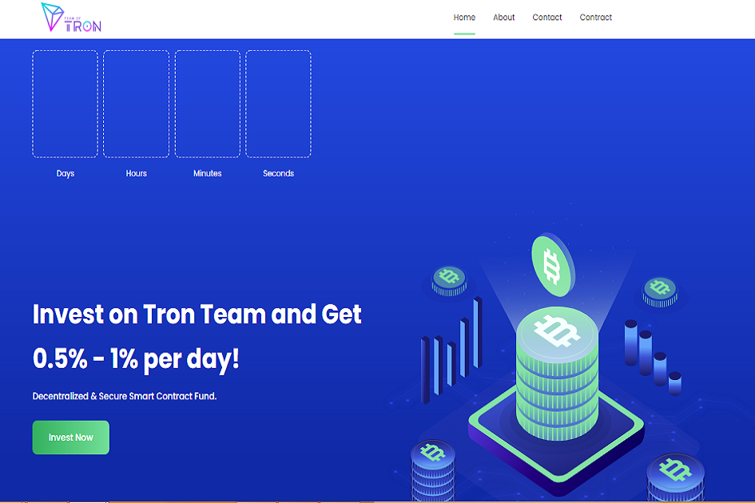

---
title: "Team of Tron"
description: "TeamofTron 是 Tron 区块链平台上的智能合约，每天可以给用户 0.5 到 1.0 的利润。"
date: 2022-08-20T00:00:00+08:00
lastmod: 2022-08-20T00:00:00+08:00
draft: false
authors: ["boogArno"]
featuredImage: "team-of-tron.png"
tags: ["High risk","Team of Tron"]
categories: ["nfts"]
nfts: ["High risk"]
blockchain: "TRON"
website: "https://dappradar.com/"
twitter: ""
discord: ""
telegram: "https://t.me/teamoftron"
github: ""
youtube: ""
twitch: ""
facebook: ""
instagram: ""
reddit: ""
medium: ""
steam: ""
gitbook: ""
googleplay: ""
appstore: ""
status: "Live"
weight: 
lightgallery: true
toc: true
pinned: false
recommend: false
recommend1: false
---
TeamofTron 是 Tron 区块链平台上的智能合约，每天可以给用户 0.5 到 1.0 的利润。 在teamoftron，随着投资的增加和矿池的增加，更多的利润给了每个用户

需要数据？
Craft 可以通过 API 提供公司的 250 多个财务、运营和人力资本指标数据点。

高通量

高吞吐量是通过将 TRON 中的 TPS 提高到日常使用的实用程度来实现的，它已经超过了比特币和以太坊。

高可扩展性

由于 TRON 的可扩展性和高效的智能合约，应用程序被赋予了更广泛的部署方式。 它可以支持大量用户。

高可用性

更可靠的网络结构、用户资产、内在价值和更高程度的去中心化共识伴随着改进的奖励分配机制。

