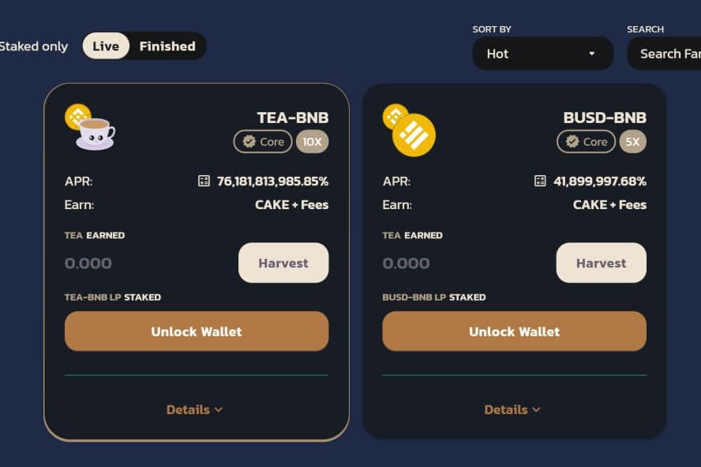

我们计划在我们的交易所下创建许多功能，目前这些功能仍将保持公开，但将在未来公开。
-交换
-巨大的APR
-令牌生成器（即将推出）

- 赌博（即将推出）

Teanance 将 DEFI 与许多现实世界的用途相结合，我们的许多想法都在我们的文档页面上。 到目前为止，teanance 已经创建了生成器 V1，这是一种创建令牌的简单方法。 您只需输入代币的“名称”、“符号”（例如比特币的 BTC）、“小数”、“总供应量”，然后点击提交。 一旦您的代币上链，您将需要增加流动性，以便人们可以购买您的资产。 点击“添加流动性”并创建一个池！
评论：Teanance 初学者指南

