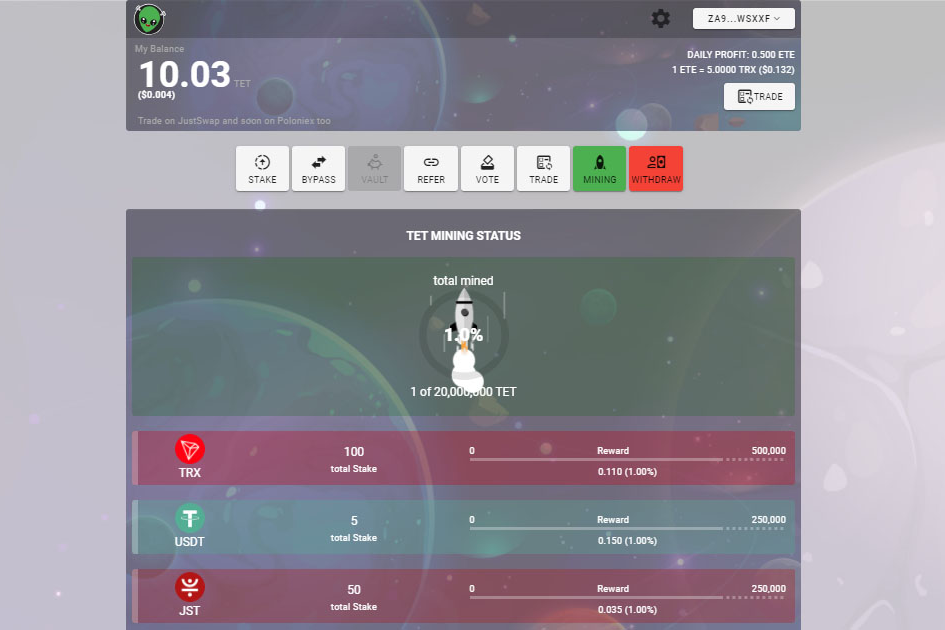

TET 是波场 DeFi 的实验平台。 TET 是一系列新服务、激励措施和平台中的第一个。 与其他 DeFi 项目一起，丰富了整个波场生态。 要参与和挖掘 TET，您需要在我们的一个活跃池中进行质押。 每个矿池都有自己的详细信息，目前支持 TRX、JST、USDJ、SUN 和 USDT。 每秒接收！ TET 可在您的帐户中逐秒使用。 随时可以取消抵押。

TET 是波场 DeFi 的实验平台。对于这些数据，我们正在跟踪：1 TET Money 智能合约

