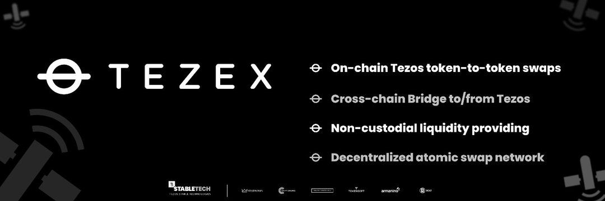

---
title: "TEZEX"
description: "TezEx（特所思交易所）是特所思上的去中心化跨链桥和代币交易所。 TezEx 为流动性提供者提供非托管流动性提供。"
date: 2022-08-20T00:00:00+08:00
lastmod: 2022-08-20T00:00:00+08:00
draft: false
authors: ["boogArno"]
featuredImage: "tezex-1.png"
tags: ["DeFi","TEZEX"]
categories: ["nfts"]
nfts: ["DeFi"]
blockchain: "Tezos"
website: "https://dappradar.com/"
twitter: "https://twitter.com/TezosExchange"
discord: ""
telegram: ""
github: "https://github.com/StableTechnologies/TEZEX"
youtube: ""
twitch: ""
facebook: ""
instagram: ""
reddit: ""
medium: ""
steam: ""
gitbook: ""
googleplay: ""
appstore: ""
status: "Live"
weight: 
lightgallery: true
toc: true
pinned: false
recommend: false
recommend1: false
---
TEZEX 是一个 Tezos 流动性交易所，通过链间和链内代币交易扩大流动性。 TEZEX Bridge 支持 Tezos 代币与其他区块链（如以太坊）的代币之间的跨链代币交换——也就是说，以太坊 ERC 标准代币（例如 ERC-20）可以交换为 Tezos FA 标准代币（例如 FA-1.2、FA- 2.0）。

2022 年 TEZEX 的未来进展：BSC-Tezos 集成（以太坊气体解决方法）BTC Taproot 集成（比特币-Tezos 互换）Changemaker 桌面应用程序，便于流动性/收益管理变革者选择自己的费用交易者限价单

