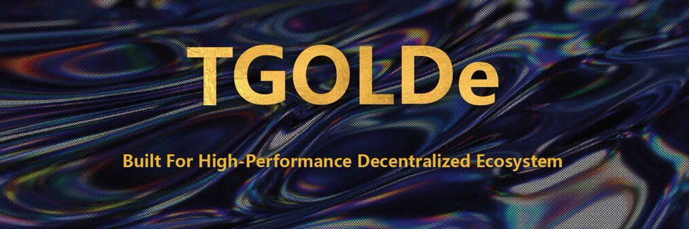

TGOLDe 在 TRON 上推出，专为高性能去中心化生态系统而构建。Tron 版本的 EIDOS
TGOLDe正式上线BitKeep
用你的免费 tron 能量挖掘 TGOLDe
构建DEX+基金+游戏生态
白名单现已开放，1000 万 TGOLDe 赠品

TGOLDe Fund是一只投资基金。 它基于 TRON。 该平台允许用户每天赚取高达 3.5% 的投资回报率。 还有 7% 的推荐奖金。 提款可以在任何时间点进行。
TGOLDe 基金社会概况：TGOLDe基金dApp分析
触手可及的最重要的 TGOLDe Fund dApp 指标 - 分析下面的深度图表，评估 dApp 在不同时间段的活动并做出快速、准确的决策！

