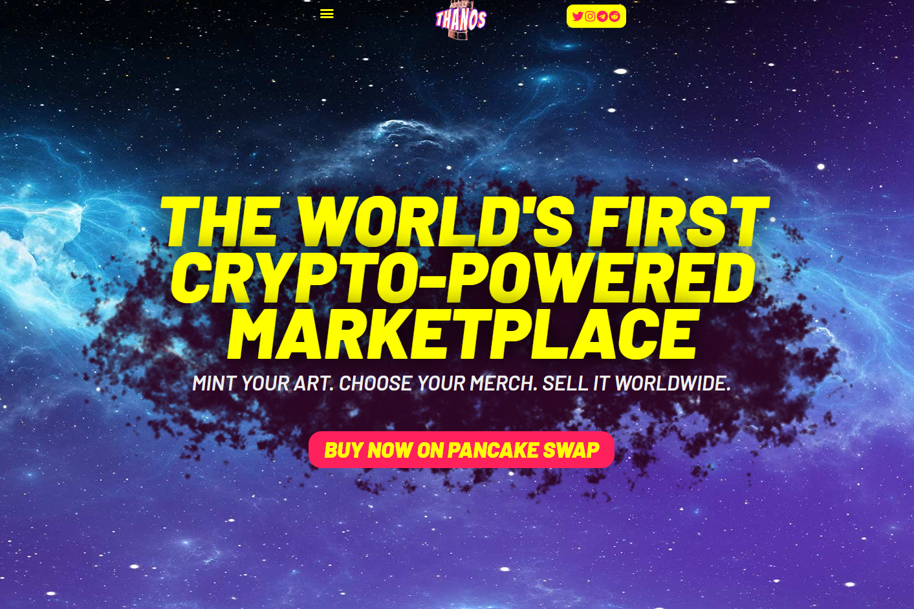

---
title: "Thanos Token"
description: "我们的灭霸平台将使用 NFT 和区块链技术为您的服装和商品品牌提供端到端的认证。"
date: 2022-08-20T00:00:00+08:00
lastmod: 2022-08-20T00:00:00+08:00
draft: false
authors: ["boogArno"]
featuredImage: "thanos-token.png"
tags: ["Marketplaces","Thanos Token"]
categories: ["nfts"]
nfts: ["Marketplaces"]
blockchain: "BSC"
website: "https://dappradar.com/"
twitter: "https://www.twitter.com/TheThanosToken"
discord: "https://discord.gg/8Dxv4yPtvy"
telegram: "https://t.me/TheThanosTokenChat"
github: ""
youtube: ""
twitch: ""
facebook: ""
instagram: ""
reddit: ""
medium: ""
steam: ""
gitbook: ""
googleplay: ""
appstore: ""
status: "Live"
weight: 
lightgallery: true
toc: true
pinned: false
recommend: false
recommend1: false
---
Thanos 代币是一个社区主导的代币，最初在公平和平等的代币发行上燃烧了所有代币的 50%。 我们拥有强大的代币经济学，向我们的社区提供 3% 的持有者分配，并为每笔交易提供 7% 的流动性锁定。
我们相信的核心是好的设计。 凭借这种精神，我们正在创建第一个以加密货币为先的市场，该市场将 NFT 艺术作为其核心，允许任何持有者生产经认证的商品以在全球范围内交付。

