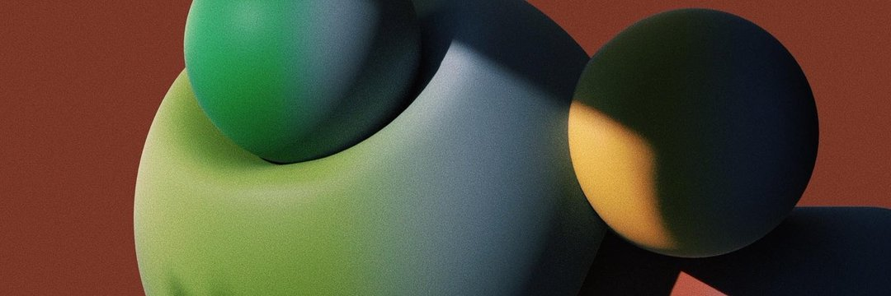

---
title: "the#boi"
description: "boiz & gurlz 的母亲。 Boiz_collection"
date: 2022-08-20T00:00:00+08:00
lastmod: 2022-08-20T00:00:00+08:00
draft: false
authors: ["boogArno"]
featuredImage: "the-boi.png"
tags: ["Collectibles","the#boi"]
categories: ["nfts"]
nfts: ["Collectibles"]
blockchain: "ETH"
website: "https://dappradar.com/"
twitter: "https://twitter.com/iamlirona"
discord: ""
telegram: ""
github: ""
youtube: ""
twitch: ""
facebook: ""
instagram: ""
reddit: ""
medium: ""
steam: ""
gitbook: ""
googleplay: ""
appstore: ""
status: "Live"
weight: 
lightgallery: true
toc: true
pinned: false
recommend: false
recommend1: false
---
#boi 系列是一系列独特的雕刻收藏头像。 最初的#boi 是#mother 和艺术家LIŔONA 在VR 中的梦想。 每个都代表了元宇宙中无性别生物的不同原型。

#boi 系列是一系列 100 个独特的雕刻收藏头像。 最初的#boi 是#mother 和艺术家LIŔONA 在VR 中的梦想。 每个都代表了元宇宙中无性别生物的不同原型。 大多数#boiz 是 1/1，而其他的则是版本。 总共只有 1000 个#nfts。

#boi 是什么？
#boi 系列是一系列独特的雕刻收藏头像。 最初的#boi 是#mother 和艺术家LIŔONA 在VR 中的梦想。 每个都代表了元宇宙中无性别生物的不同原型。

