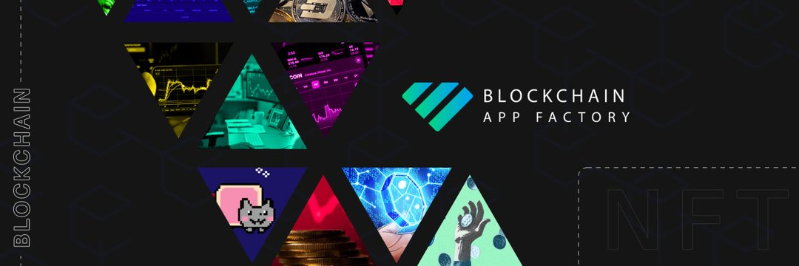

加密工厂按照目前的打印效率每天支付 6%。 随着您和其他玩家购买工人、再投资印刷的 BUSD 和提取 BUSD，采矿效率会上升和下降。
虽然 BUSD 加密工厂算法确保所有用户都能获得公平份额的奖励，但它也通过其再投资计划有利于其最支持的用户。 再投资可以通过点击“购买更多工人”按钮来完成。
策略是个人的，您要么每天“购买更多工人”，要么每天“提取您的 BUSD”，或者您将两者健康地结合起来。 我们认为，最好的策略是每天复利。 一旦您对每天、每周或每月的结果感到满意，就可以在您认为合适的情况下尽可能多地获利，然后继续将其余部分进行再投资。

