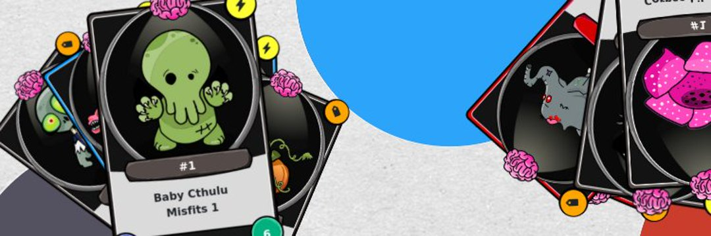

目标是收集稀有且独特的不死 NFT 卡，赚取或交易 BEP-20 Cryptoz eXPerience (CZXP) 代币以解锁新关卡。 每张铸造的 NFT Cryptoz 卡都是币安智能链上的唯一代币。 收藏家可以通过任何符合标准的钱包、市场、游戏引擎、交易所、DeFi 和其他未来发明来购买、出售和交换他们的 Cryptoz NFT 卡和 CZXP 代币Zoombies NFT 世界。 不和谐：https://t.co/izUxA2gDvS
#NFT 收藏集换式卡#GameFi 建立在稀缺性、稀有性和社区之上。
现在通过 XCM 集成连接，为链之间的 $SDN 和 $MOVR 令牌传输打开双向通道，并继续为 Kusama 内的互操作应用程序铺平道路

