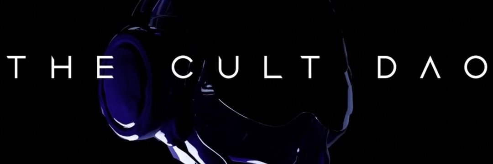

在以太坊区块链上注册的 NFT 代币 - 戴头盔的女孩，通过分权授予其持有者对 Beepl、Pak、Banksy、Hackatao、XCopy 等著名艺术家的作品以及 CryptoPunks、Bored 等顶级收藏品的 NFT 的独家所有权 Ape Yatch Club 和其他可能出现的蓝筹 NFT 项目。 只需持有一个 Girl in the Helmet NFT 代币，个人不仅将有独特的机会拥有当前和未来的稀有 NFT 收藏，还可以获得其他会员特权、赠品抽奖和未来 Cult DAO 活动的独家访问权！CulD 是 NFT 的集合，作为 Cult DAO 成员的入场券。

