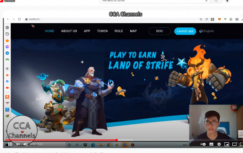

---
title: "The Land Of Strife"
description: "Land of Strife 通过“玩赚钱”的经济模式将玩家和游戏紧密结合在一起。"
date: 2022-08-21T00:00:00+08:00
lastmod: 2022-08-21T00:00:00+08:00
draft: false
authors: ["boogArno"]
featuredImage: "the-land-of-strife.png"
tags: ["NFT Games","The Land Of Strife"]
categories: ["nfts"]
nfts: ["NFT Games"]
blockchain: "Other"
website: "https://www.losnft.io/"
twitter: "https://twitter.com/Land_Strife"
discord: "https://discord.gg/zshPehfhVV"
telegram: "https://t.me/landofstrife"
github: ""
youtube: ""
twitch: ""
facebook: ""
instagram: ""
reddit: ""
medium: ""
steam: ""
gitbook: ""
googleplay: ""
appstore: ""
status: "Live"
weight: 
lightgallery: true
toc: true
pinned: false
recommend: false
recommend1: false
---
Strife 的玩家可以通过 PVE 的战斗模式获得大量的资产和代币，然后在游戏中获得巨大的收益和代币。或者出售）可以促成自己的英雄市场交易部分。
Land of Strife 通过“玩赚钱”的经济模式将玩家和游戏紧密结合在一起。在《纷争之地》中，玩家可以通过 PVE 战斗模式获得大量收益（例如游戏中可以在公开市场上公开出售的资产和代币），或者通过培养自己的英雄获得被动收入。

