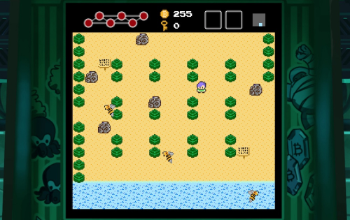

The Ledger of Szabo 是一款受经典 8 位电子游戏启发的冒险游戏。我们的冒险家发现自己被困在一个岛上，同时寻找要解决的比特币难题。为了逃脱，我们的英雄需要找到三把魔法钥匙来解锁宝藏并离开岛屿，旅程将带他们穿越曲折的世界和充满怪物、迷宫和谜题的令人费解的地牢。该游戏不仅仅是一个有趣、怀旧的 8 位世界游戏。游戏内有 8 个独立的比特币和以太坊谜题等待在整个冒险过程中被发现，总奖金为 1 BTC。

