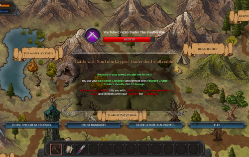

---
title: "The Legend of Aurum Draconis"
description: "寻求击败金龙！"
date: 2022-08-21T00:00:00+08:00
lastmod: 2022-08-21T00:00:00+08:00
draft: false
authors: ["boogArno"]
featuredImage: "the-legend-of-aurum-draconis.png"
tags: ["NFT Games","The Legend of Aurum Draconis"]
categories: ["nfts"]
nfts: ["NFT Games"]
blockchain: "Avalanche"
website: "https://aurumdraconis.dragoncrypto.io/"
twitter: "https://twitter.com/DRGNCRYPTOGAMIN"
discord: "https://discord.gg/dragoncryptogaming"
telegram: "https://t.me/thedragonslairfarm"
github: ""
youtube: "https://www.youtube.com/channel/UCKgqX0wKK8Fpa9aEgQ6USbQ"
twitch: ""
facebook: ""
instagram: ""
reddit: ""
medium: ""
steam: ""
gitbook: ""
googleplay: ""
appstore: ""
status: "Live"
weight: 
lightgallery: true
toc: true
pinned: false
recommend: false
recommend1: false
---
金龙传说是一款身临其境的奇幻角色扮演游戏。训练你的英雄队伍，获得经验以通过战斗或制作来提升你的统计数据，并从各种强大的武器、盔甲和物品中选择你最喜欢的装备组合。击败难度不断增加的成群敌人以获得越来越有价值的战利品，并在游戏不断发展的任务线中努力。购买地块并建立自己的封地。从战斗、制作、市场交易和迷你游戏等游戏内行动中获得有价值的代币奖励。可能性无穷无尽，命运在召唤。

