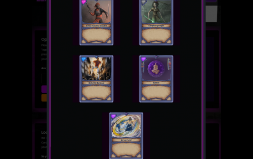

即将推出的基于数字分类帐的在线交易纸牌游戏，围绕着精巧的书面知识和尖端的智能合约后端。 234 张卡片基础系列中的各种艺术风格是因为 Fractal Studios, LLC。选择在我们的网络中利用一群非常有才华和独特的艺术家。
使用 FTM（链币）、RNDM（分形旗舰代币）或 SAGA（分形稳定）购买包，并且始终徘徊在 ~5 美元左右。所有礼包均包含 5 张卡片，并有机会获得极为稀有的 Chaotics！
P2P 交易和聊天室可用且完全安全，还有 Suprise Trade 功能，可帮助您摆脱那些双打和三打并尝试从随机玩家那里获得新卡。
游戏目前正在 Unity 中构建，并开放供公众贡献。

