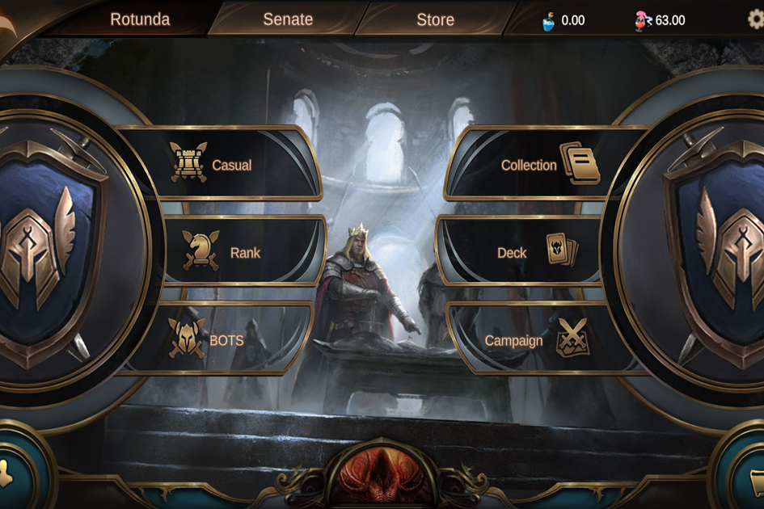

The Lost Throne (TLT) 是 Shiva Gaming 自 2019 年以来设计开发的全新元宇宙 NFT TCG 概念游戏。
The Lost Throne 是一款以 MTG 为灵感的 Play for Fun & Play to Earn 集换式卡牌游戏，任何人不仅可以获得游戏的乐趣，还可以通过高超的卡牌技巧和对生态系统的贡献来赚取代币。玩家可以在这个充满剑与魔法的神秘奇幻世界中收集、建造、战斗和交易。共创： 我们邀请各级玩家共创内容和玩法，共同定义NFT游戏的未来，玩家的改进建议将帮助我们调整NFT游戏的可用性；

