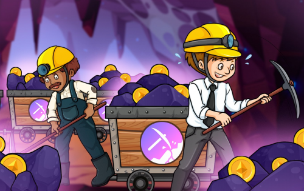

去中心化挖矿协议。是第一个提供 100% 挖矿支持的以太坊奖励的代币。通过持有$TMT，您将能够获得整个市场最高的ETH奖励，因为它是基于真实挖矿的。这使得 Mining Token 成为一个真正可持续的项目，无需铸造无限的代币来养活不可持续的权益池！成为一名真正的矿工并开始获得整个市场上最高的可持续以太坊奖励。购买 $TMT 的最佳时机是在 Mining Token Offering (MTO) 中。这是我们在扩大挖矿能力的同时向公众提供 $TMT 的活动，使我们能够在不稀释每个代币的 eth 奖励的情况下负担铸造新代币的费用。

