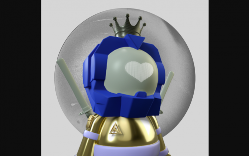

---
title: "The Moon Boyz"
description: "生活在以太坊区块链上的 11,111 个独特的收藏品 Moon Boyz。全部"
date: 2022-08-21T00:00:00+08:00
lastmod: 2022-08-21T00:00:00+08:00
draft: false
authors: ["boogArno"]
featuredImage: "the-moon-boyz.png"
tags: ["Collectibles","The Moon Boyz"]
categories: ["nfts"]
nfts: ["Collectibles"]
blockchain: "ETH"
website: "https://dappradar.com/deeplink/9393"
twitter: "https://twitter.com/the_moon_boyz"
discord: "https://discord.com/invite/moon-boyz"
telegram: ""
github: ""
youtube: ""
twitch: ""
facebook: ""
instagram: "https://www.instagram.com/moon_boyz_nft/"
reddit: ""
medium: ""
steam: ""
gitbook: ""
googleplay: ""
appstore: ""
status: "Live"
weight: 
lightgallery: true
toc: true
pinned: false
recommend: false
recommend1: false
---
Moon Boyz 是生活在以太坊区块链上的 11,111 个独特的 ERC-721 代币的集合。独特的 3D 设计，每个 NFT 都拥有一个不断发展的社区的正式会员资格和令人敬畏的实用程序。为了准备我们的月球之旅，请在下面找到班车的。一个文件，一个文件，把所有的手和胳膊都放在飞船里，直到我们到达最终目的地。我们意识到您在太空旅行的方面有很多选择，我们感谢您选择 Moon Boyz。

