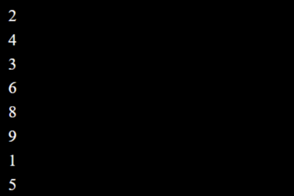

xxxxxxxxxx 存储在链上的随机生成的数字。随意以任何你想要的方式使用 n，想要支持创作者的内置受众，因为它为 n 带来了更多价值。使用数字序列为新项目带来无限可能的潜力。激励创作者利用 n 的紧密社区进行早期创作以获得知名度和销售，抽象级别使其具有普遍性。数字是一种通用语言。创作者决定供应，分销模式，售价，...... N 社区可以在您的创作之旅中分享知识、提供技术建议和从头到尾的帮助。

