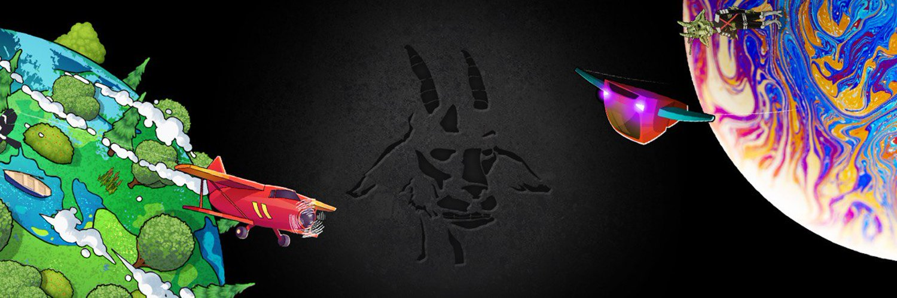

---
title: "THE REAL GOAT SOCIETY"
description: "独家社会。 GOAT Society 是 10,000 个独特 NFT 的集合，旨在联合不同社区和现实生活中的 GOATS 粉丝。"
date: 2022-08-20T00:00:00+08:00
lastmod: 2022-08-20T00:00:00+08:00
draft: false
authors: ["boogArno"]
featuredImage: "the-real-goat-society.png"
tags: ["Collectibles","THE REAL GOAT SOCIETY"]
categories: ["nfts"]
nfts: ["Collectibles"]
blockchain: "ETH"
website: "https://goatsociety.io/"
twitter: "https://twitter.com/goatsocietynft"
discord: "https://discord.com/invite/goatsociety"
telegram: ""
github: ""
youtube: ""
twitch: ""
facebook: ""
instagram: "https://www.instagram.com/goatsocietynft/"
reddit: ""
medium: ""
steam: ""
gitbook: ""
googleplay: ""
appstore: ""
status: "Live"
weight: 
lightgallery: true
toc: true
pinned: false
recommend: false
recommend1: false
---
GOAT SOCIETY 是 10,000 只独特的 NFTS 的集合，旨在联合不同的社区和真实山羊的粉丝——有史以来最伟大的系列包括 9,000 只繁殖山羊和 1,000 只独特的手绘山羊。每只山羊都作为 ERC-721 代币存储在以太坊区块链上。每只山羊都向牧群授予成员资格，这是我们来自不同社区的独家投资者群体。 HERD 成员将获得诸如参加体育比赛、学院奖、音乐节、会议和音乐会等重大活动的特别福利。

