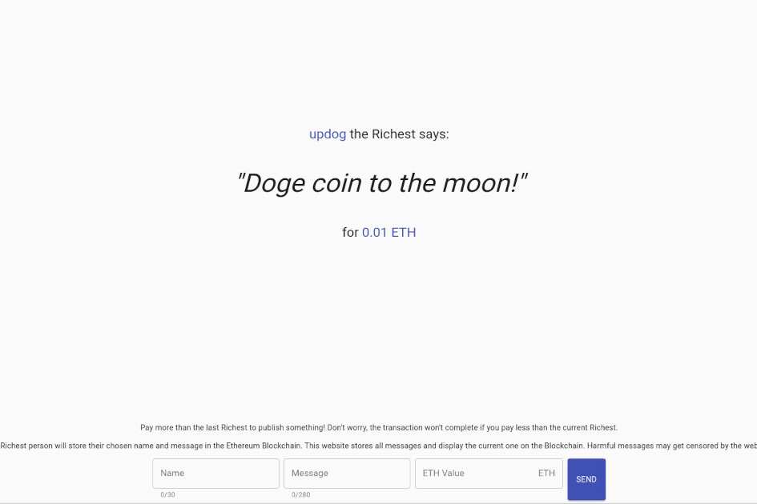

在 The Richest Says 网站上发布您想要的任何内容都比以前的 Richest 支付更高的费用！由于以太坊智能合约，交易是安全且万无一失的，并且您想要的任何内容都直接发布在区块链上 - WebApp 只是人们可以检查谁是最富有的人以及在区块链上发布的内容的前端。刚刚完成了我们最新的#Dapp 的开发，最富有的人说！由智能合约、#Ethereum 和#Web3 提供支持的简单网络广告牌！
在 http://app.therichestsays.com 上查看！

