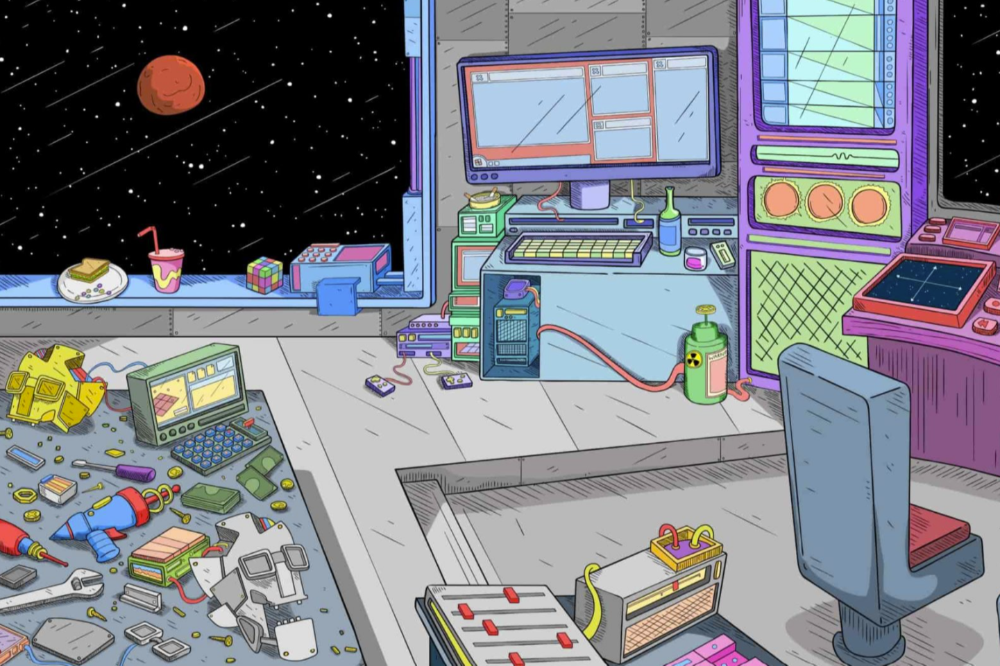

 Rogue Bots 是 15,777 个 Bots 从失败的乌托邦社会中逃脱奴役的图形表示。每个 Rogue Bot 的价格为 0.09 ETH。他们有超过 320 多个可区分的特征。所以一定要密切注意你最喜欢的盗贼！每个 Rogue 也是您进入 Rogue Society 的门票，这是一个仅限会员的 NFT + Crypto 社区。Rogue Society Bot 是 15777 个独特的 Rogue Bot NFT 的集合——生活在以太坊区块链上的独特数字收藏品。“Rogue Culture 最初是一个梦想，为想象和行动多样化的人开发一个空间，”它提供。该项目的创始人 Leche 因此与艺术家、建筑商和作家联系在一起，以使 Rogue Bots 得以存在。

 