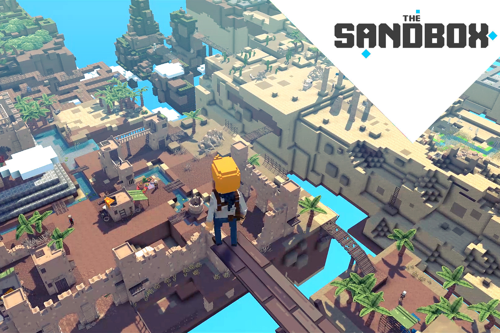

由玩家打造的去中心化游戏平台 将您的创作自由提升到一个新的水平并在区块链中获利！创建和播放！沙盒系列即将推出的游戏是一个基于 3D 体素的生态系统，其中包含玩家制作的用户生成内容 (UGC)。在 The Sandbox 中，创作者将能够制作、玩、分享和交易他们自己的游戏世界 (LANDs) 和资产，无需中央控制，拥有真正的完全所有权，享受版权安全以及赚取加密货币的能力。 The Sandbox 是 The Sandbox 特许经营权的最新版本，自 2012 年推出以来，它帮助在 iOS 和 Android 智能手机上创造了沙盒世界创造游戏类型： ● 4000 万玩家下载了 Sandbox 特许经营权 ● 最新迭代，The Sandbox Evolution，每月活跃用户 (MAU) 超过 120 万，峰值高达 260 万 ● 已创建 7000 万个世界 ● 每天创建超过 100,000 个世界

