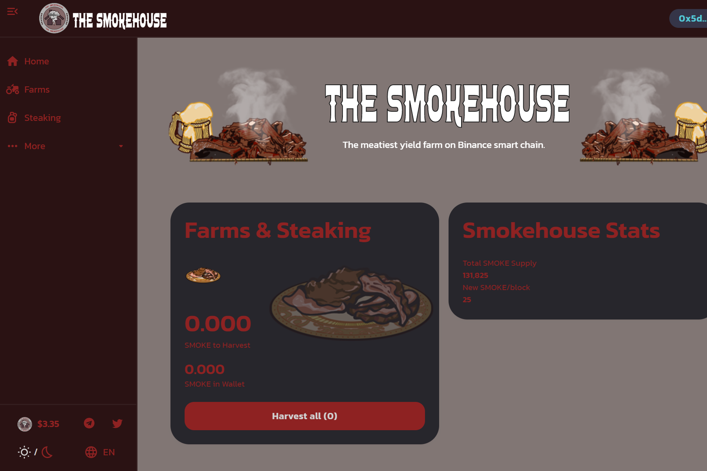

什么是熏制房？
我们是一个收益农业和 Staking 协议，将专注于两件事，即高 APY 和安全性。最近地毯太多了，所以我们的团队希望为每个人提供一个安全的环境来开展他们的 degen 农场。这个农场和将要建立的整个生态系统将领导一个值得信赖的团队，唯一的目的是保护您的投资。
使用币安智能链 (BSC) 的好处
最近，The Smokehouse 的工作团队在第一次尝试币安智能链时大吃一惊，并决定将他们的肉停在这里。即时确认、10 美分或更少的 gas 成本，以及早日参与其中的整体感觉让我们完全着迷和兴奋。
我们也看到很多人都实现了同样的认识。你可以在最近的 BNB 代币上大量抽水中看到这一点。我觉得我们都来得很早，这个团队想把自己打造成这个链条上领先和

最值得信赖的团队之一。