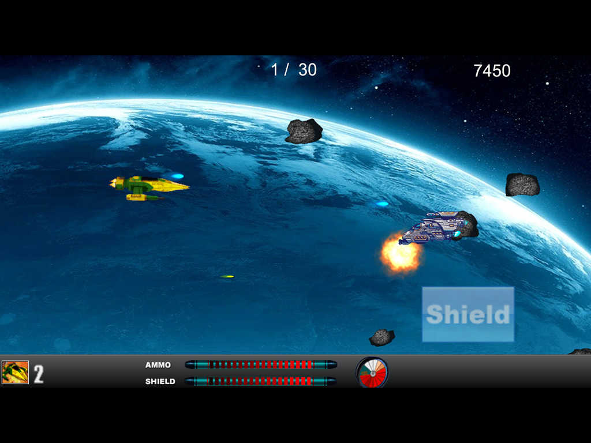

太空领域游戏
3% 每日利息合约基础。
5% 推荐奖金，奖励将直接进入钱包。
每 12 小时 4% 的叠加复合奖励，最多 7 天。
30小时截止时间。
12小时撤回冷却。
12小时复合冷却。
200 太空矿石最低投资。
每个钱包最多可存入 30,000 个太空矿石。
连续 2 次提款需缴纳 40% 的反馈税。
*税收将保留在合同中。
这是 Space Eco System 的第一层，最初将是 $SPO 的用例。

Space Field Game是一款基于币安智能链的去中心化游戏。 游戏的目标是比其他玩家更快、更频繁地招募更多的宇航员。 这反过来又能让你更快地获得更多的太空矿石。 这些宇航员不知疲倦地为您工作，每天平均为您提供 3.33% 的宇航员价值。

