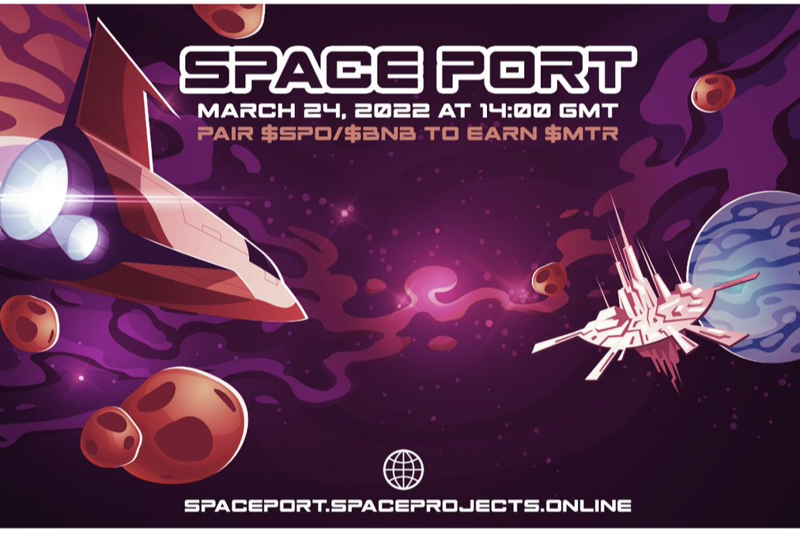

陨石太空港机器令牌 - 0xa19d8E92db448ff00AC763fFeC83b50F39f47e21
正式发布日期：14:00 UTC 03/24/22！
随着越来越多的用户将 SPO/BNB LP 投入到项目中，MTR 代币的价值将会上升。
1. 质押 SPO/BNB LP 并赚取 MTR 代币的每日质押奖励（每天 5%）。您可以随时领取您的                      MTR 奖励。您不能取消质押您质押的 SPO/BNB LP 。
` 无论 MTR 价格如何，您都将按 SPO/BNB LP 投资的百分比赚取 MTR 代币。
` 投资者对他们的 MTR 代币有两种选择，您可以将它们出售为 SPO/BNB LP，或者您可以质押它们以赚取更多的 MTR 代币（每天 7%）。 MTR 质押锁定 7 天。
2. 项目术语
` 总供应量：可以存在的最大 MTR 数量。
` 流通供应量：目前在投资者钱包中的 MTR 代币数量。
` 可用供应：（总供应 - 循环供应）。
` MTR 价格：（总 SPO/BNB LP 余额/可用供应量）。
3. Mint MTR - 当您从铸币中获得 MTR 时，它会从可用供应中移除并添加到流通供应中。
4. 卖出 MTR - 当您卖出 MTR 时，它会从流通供应中移除并添加到可用供应中。

1. 