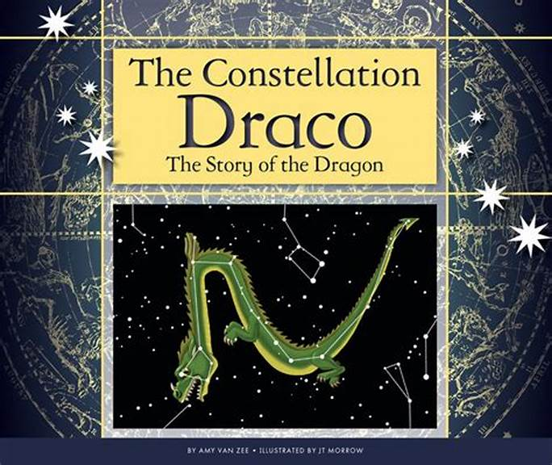

Draco 的故事是一个全新的 DeFi 项目，由 Fantom 网络上经验丰富的开发团队设计，具有许多功能，例如 Draco 理论、灾难、银行、金库、Staking、DEX、Yield Farming、强大的合作伙伴关系

涉及德拉科的最著名的故事讲述了他是赫拉克勒斯为了拥有赫斯珀里得斯的金苹果而必须击败的龙。 德拉科也被视为守护金羊毛的巨龙，也是在奥林匹斯诸神与泰坦大战时被雅典娜女神打败的巨龙。

Draco 的故事是一个全新的 DeFi 项目，由 Fantom 网络上经验丰富的开发团队设计，具有 Draco 理论、灾难、银行、金库、Staking、DEX、Yield Farming、强大的合作伙伴关系等许多功能

请提醒，请始终进行自己的研究！ 只投资你能承受的损失。

