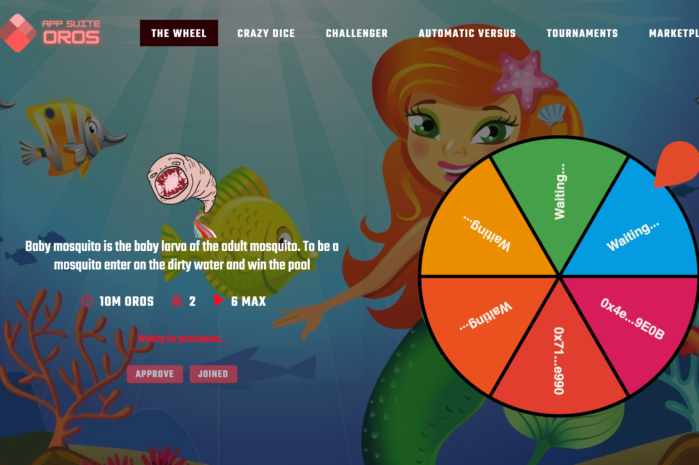

---
title: "The Wheel OROS"
description: "The Wheel OROS 是一款基于赌博的应用程序，您可以通过加入不同的幸运轮来赢取 OROS，并等待其他用户加入开始赢取"
date: 2022-08-20T00:00:00+08:00
lastmod: 2022-08-20T00:00:00+08:00
draft: false
authors: ["boogArno"]
featuredImage: "the-wheel-oros.png"
tags: ["Gambling","The Wheel OROS"]
categories: ["nfts"]
nfts: ["Gambling"]
blockchain: "BSC"
website: "https://gamesuite.oros.finance/"
twitter: "https://twitter.com/orosfinance"
discord: ""
telegram: "https://t.me/orosfinance"
github: ""
youtube: "https://www.youtube.com/channel/UCjDKIAzRkEOqUZk1mehn22w"
twitch: ""
facebook: "https://www.facebook.com/profile.php?id=100068996774096"
instagram: "https://www.instagram.com/oros.finance/"
reddit: ""
medium: ""
steam: ""
gitbook: ""
googleplay: ""
appstore: ""
status: "Live"
weight: 
lightgallery: true
toc: true
pinned: false
recommend: false
recommend1: false
---
The Wheel OROS 是一款基于赌博的应用程序，您可以通过加入不同的财富轮盘赢取 OROS，并等待其他用户加入开始赢取。
游泳池如何运作？
● 如果用户有足够的 OROS 支付矿池价格，则用户加入矿池。
● 用户等待达到矿池的参与人数。
● 当池达到最大参与者时，轮盘自动开始旋转，以随机显示所有参与者的获胜者 BEP-20 地址出现在轮盘上。
● 付款将自动发放给获胜者。
● 即使您关闭浏览器，付款也会发放给获胜者。

