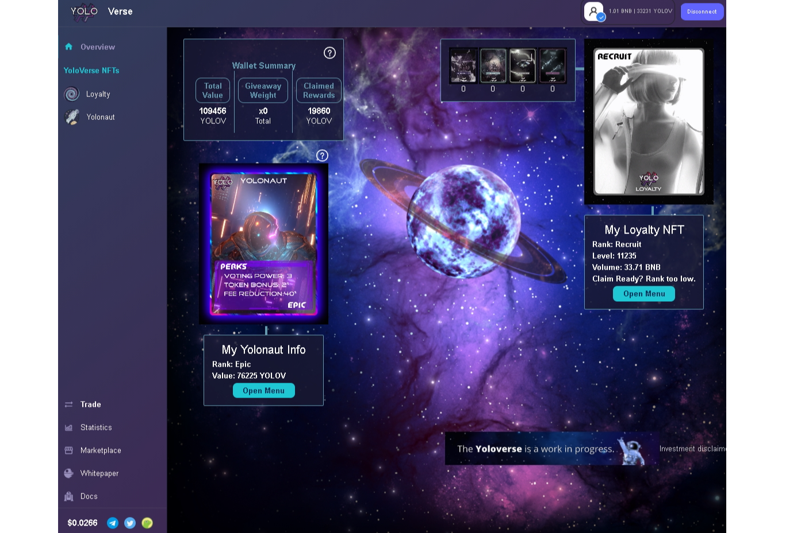

YoloVerse 协议将创新的 NFT 智能合约与 DeFi 方面相结合，包括收益农业、DAO 治理和 GameFi 元素。
由 DeFiYield 和 Solidity Finance 审计。

YoloVerse 协议将创新的 NFT 智能合约与 DeFi 方面相结合，包括收益农业、DAO 治理和 GameFi 元素

Yoloverse 是币安智能链上的一个新的 DeFi 协议，它引入了 NFT，可以在项目的原生代币中获得收益，提供协议费用折扣，并具有可以由用户升级的稀有度排名。

在本次审计中，我们审查了项目的 Artifact、Keeper、Loyalty、Yolonaut 和 YoloV 合同。 该代码在项目团队的私人 GitHub 存储库上的提交 df38450736bda7457e9cafa570e6d1efc8f3e780 上进行了审查。

