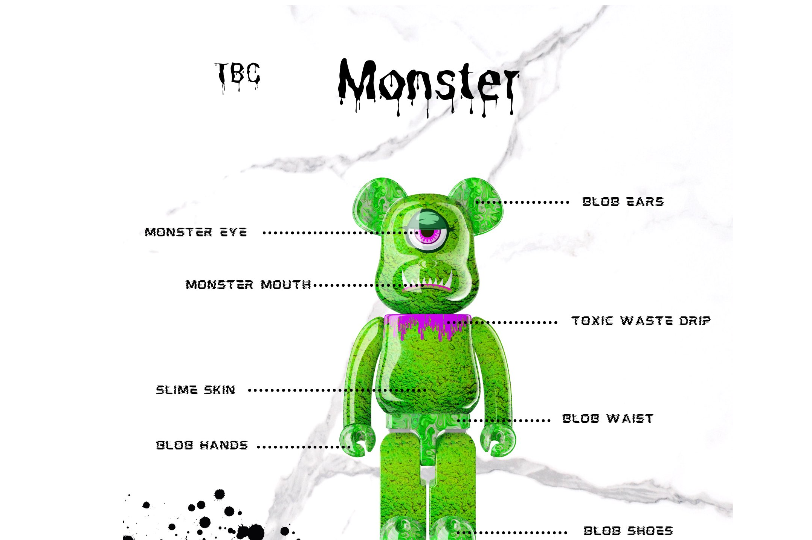

TBC - 精心策划的独家#NFT 系列，提供对 TBC 品牌的混合访问，
薄荷的物理艺术 + 更多
访问 Web 和 Twitter 获取新闻并加入 Telegram。

- 前 Genshin Impact 首席关卡设计师
- 前合同育碧环境设计师乔恩

- 前腾讯游戏开发团队负责人

- 前 Lilith Games 开发者（王国崛起、AFK 竞技场）

  大先知 - 11 至 15 创世纪熊猫
  1⃣ + 2⃣ + 3⃣ + 4⃣
  4⃣ 分配小军队进行自动化任务 - 派出你的部队为你完成任务（可能会死，死去的部队不会被补充

  