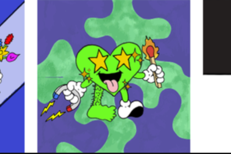

The Heart Project 是一个社区经营的创意工作室，它使充满激情的创意爱好者能够塑造我们与之互动的艺术。基于以太坊的区块链上的 10,000 个独特代币将作为会员通行证，授予对创意贡献的访问权限和对我们组创作的共享所有权。 Heart Project 创意工作室旨在制作每个项目都有数千名贡献者的媒体，并授予我们共享创作的所有权。Netflix 聘请了 Heart Project 背后的艺术家 Stefan Meier，通过一系列 Stranger-Things 风格的绘画、素描和单品服装，为新的 Strangers Things 季发布增添魅力。

