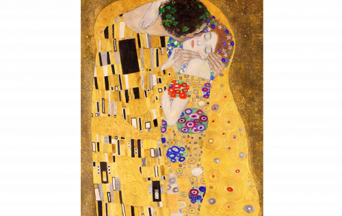

---
title: "TheKiss by Gustav Klimt"
description: "历史上第一次，维也纳的丽城博物馆与 artèQ 合作，正在放弃其历史古斯塔夫·克里姆特 (Gustav Klimt) 杰作 The Kiss(Love) 的 NFT"
date: 2022-08-21T00:00:00+08:00
lastmod: 2022-08-21T00:00:00+08:00
draft: false
authors: ["boogArno"]
featuredImage: "thekiss-by-gustav-klimt.png"
tags: ["Collectibles","TheKiss by Gustav Klimt"]
categories: ["nfts"]
nfts: ["Collectibles"]
blockchain: "ETH"
website: "https://thekiss.art/"
twitter: "https://twitter.com/arteQio"
discord: "https://discord.gg/G4Vrn6JXQZ"
telegram: ""
github: ""
youtube: ""
twitch: ""
facebook: "https://www.facebook.com/arteq.io"
instagram: "https://www.instagram.com/arteQ.io"
reddit: ""
medium: ""
steam: ""
gitbook: ""
googleplay: ""
appstore: ""
status: "Live"
weight: 
lightgallery: true
toc: true
pinned: false
recommend: false
recommend1: false
---
维也纳的 Belvedere 博物馆与 NFT 投资基金 artèQ 合作推出了一款不可替代的代币 (NFT)，其灵感来自奥地利画家古斯塔夫·克里姆特最著名的作品之一“吻”。
在情人节发布的 20 世纪初一对恋人描绘的数字副本被分成 100 x 100 的网格，由 10,000 个单独的片段作为 NFT 提供。星期五是揭示日
购买和铸造的所有 The Kiss Nfts
在周六至周五午夜之间购买的所有 NFT 将在周五公布并放入钱包。

