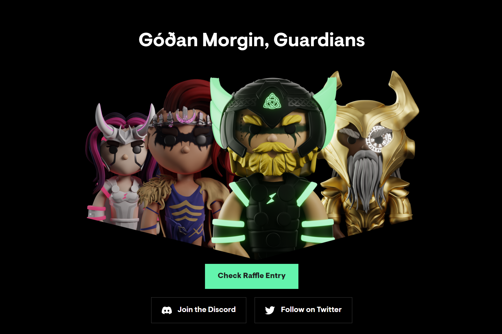

---
title: "ThorGuards"
description: "早安，守护者"
date: 2022-08-20T00:00:00+08:00
lastmod: 2022-08-20T00:00:00+08:00
draft: false
authors: ["boogArno"]
featuredImage: "thorguards.png"
tags: ["Collectibles","ThorGuards"]
categories: ["nfts"]
nfts: ["Collectibles"]
blockchain: "ETH"
website: "https://www.thorguards.com/"
twitter: "https://twitter.com/thorguards"
discord: "https://discord.com/invite/thorguards"
telegram: ""
github: ""
youtube: ""
twitch: ""
facebook: ""
instagram: ""
reddit: ""
medium: "https://medium.com/@thorguards"
steam: ""
gitbook: ""
googleplay: ""
appstore: ""
status: "Live"
weight: 
lightgallery: true
toc: true
pinned: false
recommend: false
recommend1: false
---
ThorGuards 是以太坊区块链上 9,999 个 NFT 字符的集合，其灵感来自 THORChain、北欧神话和赛博朋克美学。
每个 ThorGuard 都是数百种潜在属性的完全原创组合。 该系列具有真正独特且功能强大的 3D 艺术品，并为持有者提供了首创的实用程序。

2022. 8. 17. · ThorGuards - THORChain 社区的 NFT ThorGuards 是以太坊区块链上 9,999 个 NFT 字符的集合，其灵感来自 THORChain、北欧神话和赛博朋克美学。

             ThorGuards 是以太坊区块链上 9,999 个 NFT 字符的集合，其灵感来自 THORChain、北欧神话和赛博朋克美学。 每个 ThorGuard 都是数百种潜在属性的完全原创组合。 该系列具有真正独特且功能强大的 3D 艺术品，并为持有者提供了首创的实用程序。

             