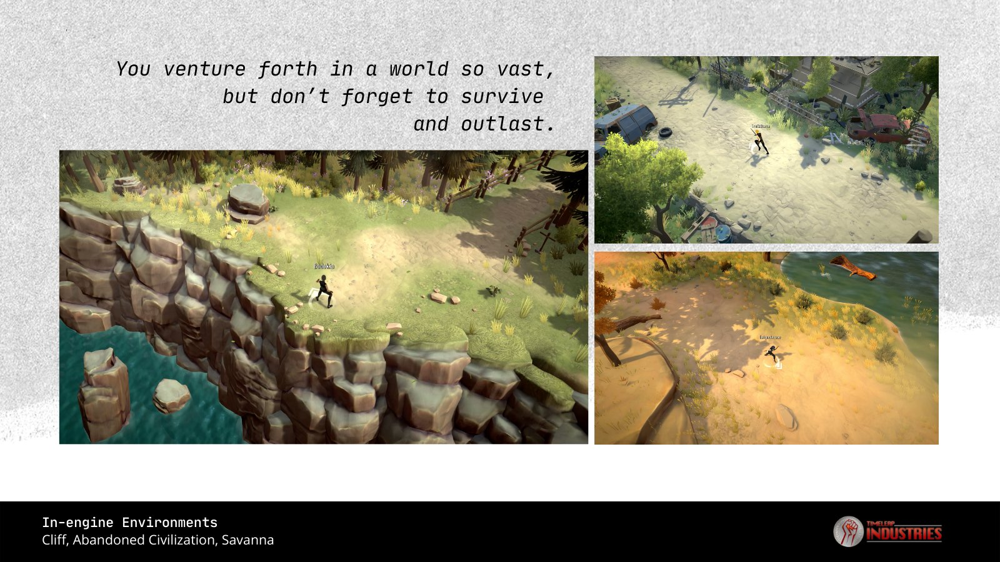

---
title: "Timeleap Finance"
description: "Polygon链上的下一代高收益和可持续资产农业生态系统，由单产农民构建，为单产农民."
date: 2022-08-20T00:00:00+08:00
lastmod: 2022-08-20T00:00:00+08:00
draft: false
authors: ["boogArno"]
featuredImage: "timeleap-finance.png"
tags: ["DeFi","Timeleap Finance"]
categories: ["nfts"]
nfts: ["DeFi"]
blockchain: "Polygon"
website: "https://timeleap.finance/"
twitter: "https://twitter.com/TimeleapGameFi"
discord: ""
telegram: ""
github: "https://github.com/timeleapfinance/"
youtube: ""
twitch: ""
facebook: ""
instagram: ""
reddit: ""
medium: "https://timeleap.medium.com/"
steam: ""
gitbook: ""
googleplay: ""
appstore: ""
status: "Live"
weight: 
lightgallery: true
toc: true
pinned: false
recommend: false
recommend1: false
---
TIMELEAP FINANCE - Polygon 上的第一个农场，具有可验证的最大供应和无限的农业潜力
Timeleap Finance 是由单产农民为单产农民创建的新时代高 APR 农场。我们正在 Polygon 链上创建一个高收益资产生态系统，以可持续的代币经济学为基础。
TIME 代币可以通过参与收益耕种计划进行耕种。它的可验证最大供应量为 86,400 个‌——一旦 TIME 代币合约由 MasterChef 合约拥有，我们改进的智能合约可防止任何超过最大供应量的 TIME 代币的进一步铸造。我们还添加了一个 finalMint() 函数，它允许我们的 MasterChef 合约将所有剩余的未铸造 TIME 代币铸造给自己。
此外，它具有无限的农业潜力，因为我们永远不会将排放量降至零。由于最大供应量有限，因此无需担心通货膨胀会飙升。
作为我们持续回购和制造政策的一部分，我们将在我们的策略合约中实施一系列自动复利策略，所有这些都是为了从公开市场回购 TIME。 MasterChef 获得一部分 TIME，其余部分通过我们的协议进入我们的财政部合同，用于未来的效用。

