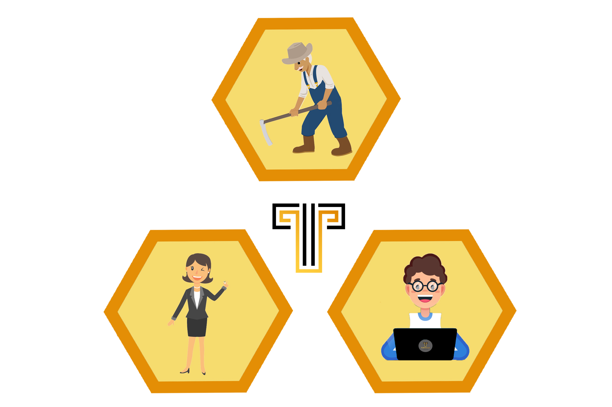

行业网络旨在为具有不同加密经验水平的用户提供一个安全的投资环境。例如，我们易于遵循的视频指导没有经验的加密用户完成使用法定货币购买加密货币的过程，然后一直到购买 在我们上架的 DEX 上的代币上。 Tinville 旨在成为满足所有 DeFi 需求的一站式解决方案。 TheTinville 农场是一个高收益农场，旨在让用户获得稳定的被动收入，同时赚取 tinville 生态系统的消费货币。 治理代币 Tinv 允许持有者除了对项目的方向进行投票外，还可以对可以在农场使用哪些新池和对进行投票。 两个令牌的用例详细信息将在适当的时候发布。

