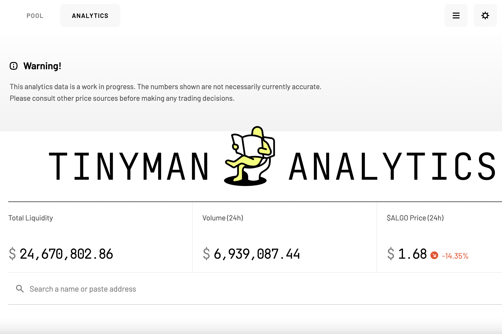

Tinyman 是一个去中心化的交易协议，利用 Algorand 区块链的快速安全框架为交易者、流动性提供者和开发者创建一个开放和安全的市场。 Tinyman 由一支拥有丰富金融科技背景的团队打造，其使命是充分发挥 DeFi 或在区块链上运行的金融工具的全部潜力，为广大用户提供包容、可访问和盈利的金融工具。 借助以社区为中心、廉价、快速且完全无需许可的 Tinyman 协议，用户可以使用自动做市商 (AMM) 算法通过流动性池交易任何 Algorand 标准资产（或 Algo）。

