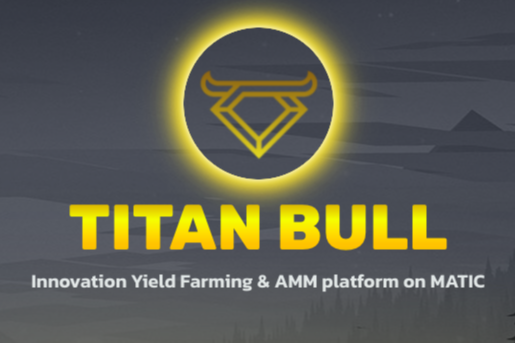

什么是天牛金融？
TitanBull Finance (TBULL) 是 Polygon (MATIC) 网络上的全新单产农业和 Staking 平台。 我们是经验丰富的智能合约/UI/UX 开发团队，对加密货币的未来有着良好的愿景。 这是一个长期的项目，而不是一个快速致富的项目。 我们的目标是成为 Polygon 上排名前三的 AMM 和 Yield Farm

泰坦牛利润分享池住了。 您现在可以质押 TBULL 并赚取 USDC。

