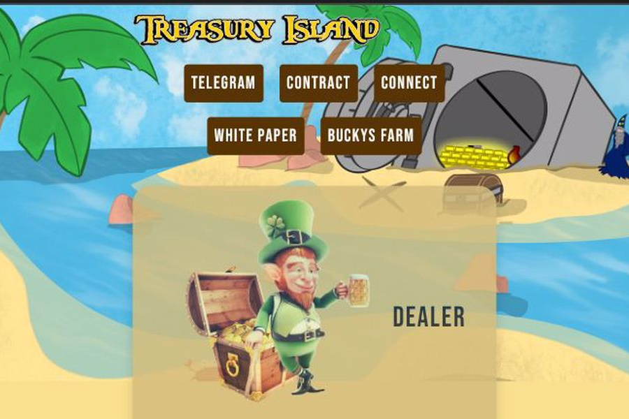

金银岛项目在 BSC 带来了它的第一个生态系统。它提供功能：DEX、质押和农业。它有更多的计划，例如：治理、第 2 层资产、NFT 等等。
质押功能将股份百分比分配给用户，DEX 内的每笔交易都会为股东产生股息。
Buckysfarm 是一个农业功能，一个独特的实用程序 dapp，用户可以在其中使用代币来雇佣农民，每天的动态投资回报率约为 1%，并且设置为具有平均投资比率 (AIR) 的可持续性。

