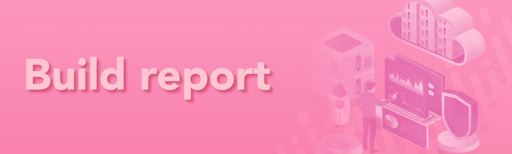

欢迎来到 TreatDAO - 一个可以铸造和出售私人有限 NFT 的地方。使用我们的简化工具创建为您的社区量身定制的 SFW 和 NSFW 内容。从您的初始销售中获得报酬，并通过二级市场销售获得经常性收入。每次您的内容在我们平台上的收藏家之间被出售或交换时；您可以从中分得一杯羹！
我们很高兴地宣布，Treat DAO 已同意在 P2PB2B 上市，P2PB2B 是排名前 30 位的加密货币交易所，在与项目合作的历史悠久，这些项目包含和保护代币税，这对于资助持续开发和营销很重要。在 P2PB2B 上，我们将对每笔交易征收 2% 的代币经济学税，就像在 PancakeSwap 和其他去中心化交易所一样。

