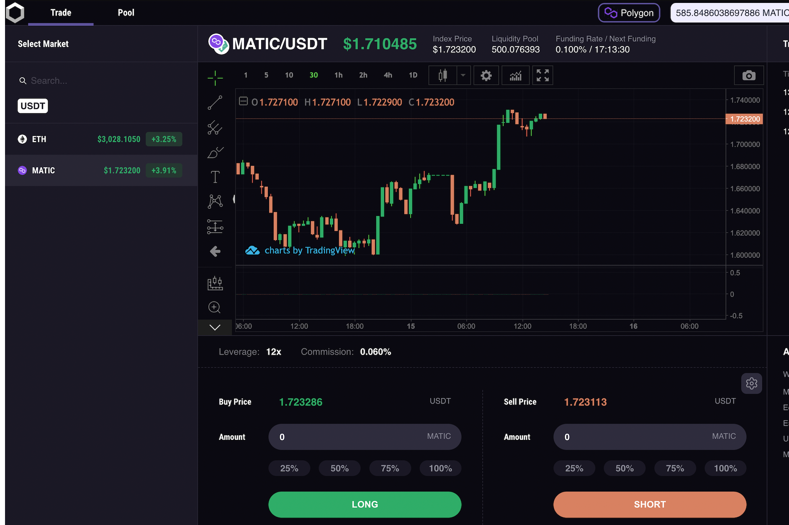

TripleFi 是一种衍生 DEX，它使用户能够以高达 25 倍的杠杆率交易加密货币，并投资 LP 池以获得可观的回报。
目前 TripleFi 在 Polygon Network 上可用，您可以在 Ethereum Rinkeby 测试网络上进行刺激交易。请加入我们的社区以获取更新。

25 倍杠杆：交易者可以使用高达 25 倍的杠杆进行多头或空头 24/7 交易

有竞争力的费率：TripleFi 提供最优惠的交易费率，以最大程度地降低交易者的交易成本

降低滑点：我们采用价格变动算法的净头寸做市方法提供了更低的滑点

