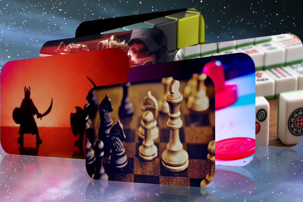

什么是海卫一站？对 TRTN 代币的需求是一项好的投资吗？
Triton Station 是一个使用 Solana 区块链技术进行社交互动的平台。 Triton Station 是由对新网络技术着迷的充满激情和忠诚的团队创建的。玩游戏，投资 NFT 资产，赢取和交易 TRTN 代币。
与许多其他区块链项目不同，我们尽一切努力确保对 TRTN 代币有真正的需求。我们平台上的所有游戏都使用代币，TRTN 是交易 NFT、加密音乐会和创意比赛的重要经济组成部分。
TRTN Token 的广泛内部使用及其在许多交易所平台的上市，以及与各种公司和艺术家的计划合作使其成为一项非常好的投资。您可以从投资代币中获利，也可以从我们的平台和社区的发展中获益。

