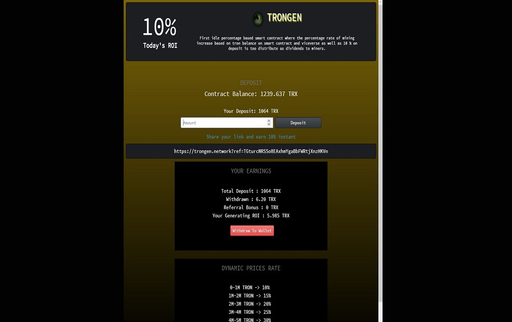

第一个基于闲置百分比的智能合约，其中挖矿百分比根据智能合约上的 tron 余额增加，反之亦然，以及 10% 的存款作为股息分配给矿工。

Tron 闲置平台：

高吞吐量是通过改善TRON中的TPS实现的，日常使用实用程度已经超过比特币和以太坊。

可扩展性基于良好的可扩展性和高效的智能合约，应用程序可以在TRON中有更多部署方式，TRON可以支持大量的用户。

TRON具有更可靠的网络结构，用户资产，内在价值，并且更高程度的分权化共识带来了改进的奖励分配机制。

