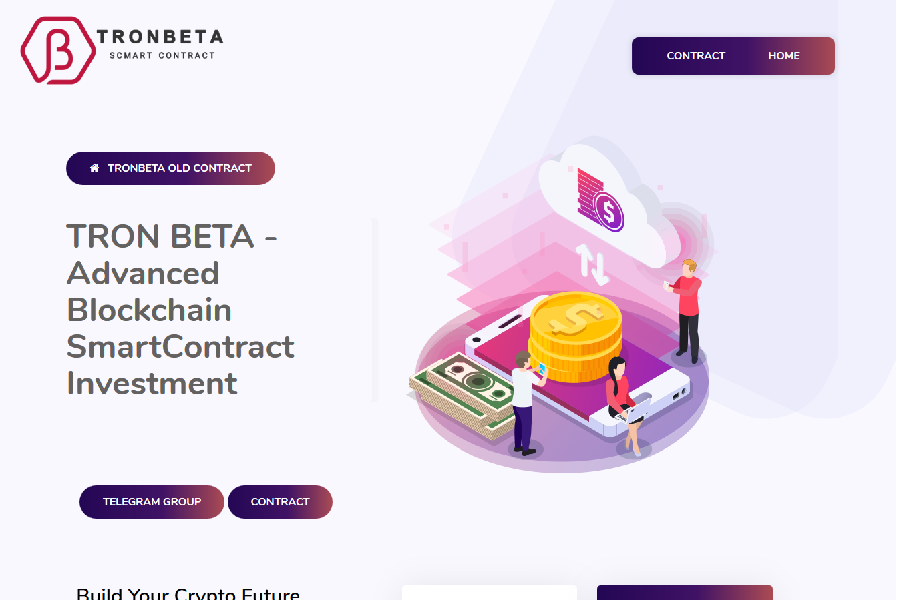

Beta 是 TRON：PSP 进化中的主角，是 Kevin Flynn 于 1985 年创建的一个程序，目的是（在 Tron 的指导下）成为第一届 Game Grid Tournament 的竞争对手。虽然在游戏中完全可定制，但 Beta 在加载屏幕和显示锦标赛中所有参赛者的屏幕中显示为蓝色电路。

🔰每日佣金！
✓ 8 % 每日投资回报率 - 50 至 9,999 TRX
✓ 9 % 每日投资回报率 - 10,000 至 99,999 TRX
✓ 10 % 每日投资回报率 - 100,000 TRX 及以上
🔰 高达 12% 的推荐奖励
💸 7 % 第一级
💸 4 % 第二级
💸 1% 三级
💸 1% 退款为第一笔存款

