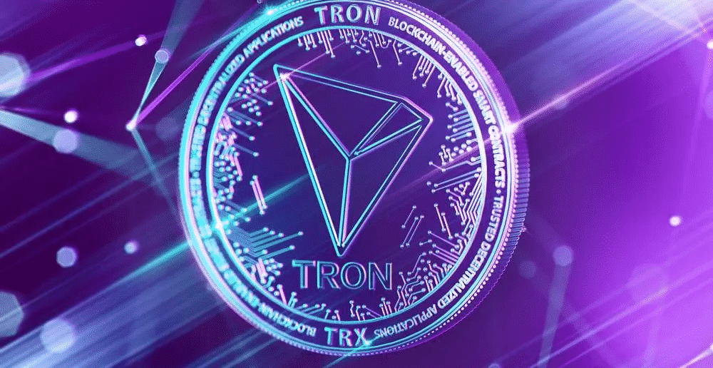

TronDividends 代币（'TDT'）交易所
40% 股息（30% 买入和 10% 卖出）
10% 推荐奖励
2% 投资的 TRX 将注入 Trondivs 合约StableFund - 使用我们的 AI 交易机器人赚取 1.5% 的奖励 - 立即质押！打开 Dapp。 Tron 股息代币。 ＃... 一般来说。 #... 高风险。 #...在波场。首先，网络用户可以通过从本地钱包中质押代币来赚取波场红利。开始质押TRX代币的流程如下：此外，它拥有非常多丰富的游戏，为用户提供了从不同来源获得越来越多红利的机会。游戏代币...

