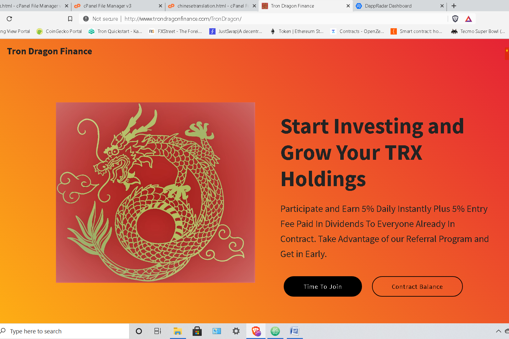

每天 5% 的投资回报率加上红利与安全机制协议到位就像我们的刺激故障当每日取款大于存款时添加 TRX。高达 10% 的推荐奖励，5% 的红利直接发送到社区钱包，5% 到 Stimulus Vault，全部返还给社区创龙财经 | Tron Dragon Finance 将每日 ROI 模型与进入/退出费红利模型全部结合在 1 中。每日 ROI 5%，10% 进入费支付...Tron Dragon Finance 是一个由 Tron 提供支持的投资平台，不仅提供 5% 的每日投资回报率，而且还支付直接发送到您钱包的股息。

