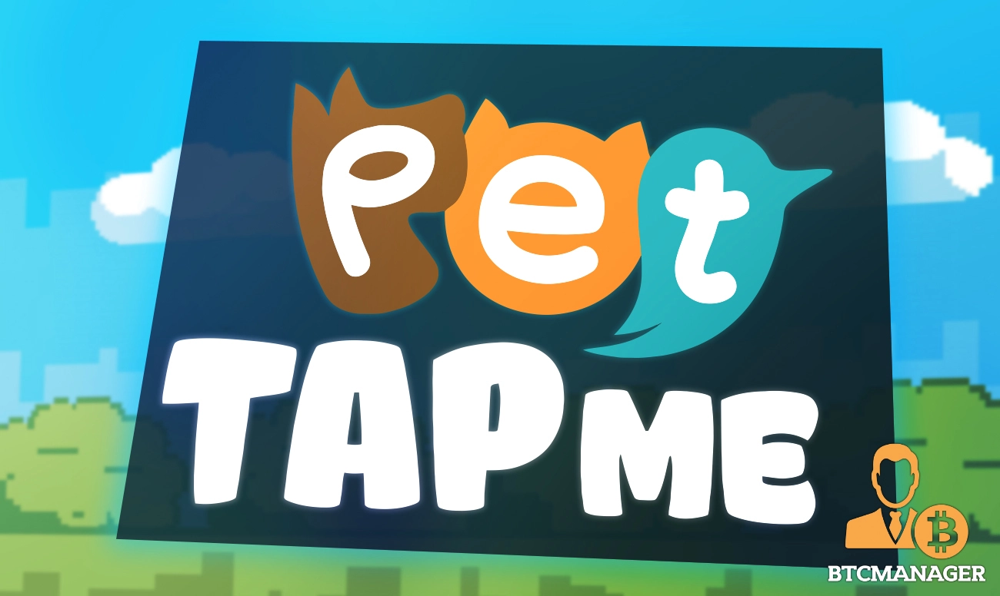

---

---

一款竞赛游戏，允许用户手动控制飞扬的鸟与受过 AI 训练的鸟比赛。飞扬的鸟 |一款竞赛游戏，允许用户手动控制飞扬的鸟与受过 AI 训练的鸟比赛。 ... 飞扬的鸟。电子游戏。访问网站。Tron Flappy Bird 档案 - Tron Spark。 Dapp · Tron DApps – 让 Tron 与众不同。 Tron，由孙宇晨创立，他是第一个从马云毕业的千禧一代......Tron Flappy Bird？一款热门竞赛游戏，允许用户手动进行控制飞扬的小鸟与受过 AI 训练的小鸟比赛。 TRON（TRX）游戏怎么样？

